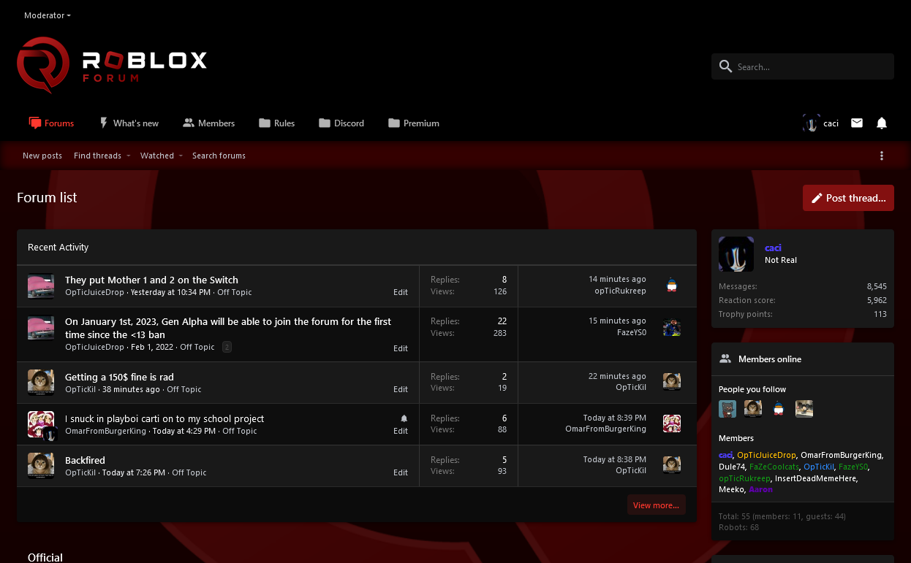

# Midnight


Midnight is a user style for RobloxForum.com.

Designed for using RobloxForum at night or alongside a dark desktop theme, Midnight provides more muted, easy-on-the-eyes visuals.
## How to install
Midnight can be used with any browser extension that allows CSS overwriting. 

The easiest way to install Midnight is via the [UserStyles website](https://userstyles.world) alongside [Stylus](https://github.com/openstyles/stylus/):
1. Download and install the Stylus browser addon ([Chrome](https://chrome.google.com/webstore/detail/stylus/clngdbkpkpeebahjckkjfobafhncgmne) | [Opera](https://addons.opera.com/en-gb/extensions/details/stylus/) | [Firefox](https://addons.mozilla.org/en-GB/firefox/addon/styl-us/))
2. Go to the [Midnight page on UserStyles](https://userstyles.world/style/1231/midnight) and click "Install" below the preview image
3. On the new Stylus tab, click the "Install" button and the theme will apply on new and opened RobloxForum tabs.
4. Done!

If your browser does not support the Stylus theme, search for a supported user styles manager and paste [source](source.css) into its editor.
## Customization
The instructions for modifying particular parts are included within the first few lines of the source code.
## Copyright
Copyright (C) 2022 Cactile
```
This program is free software: you can redistribute it and/or modify it under the terms 
of the GNU General Public License as published by the Free Software Foundation, either 
version 3 of the License, or (at your option) any later version.

This program is distributed in the hope that it will be useful, but WITHOUT ANY WARRANTY; 
without even the implied warranty of MERCHANTABILITY or FITNESS FOR A PARTICULAR PURPOSE. 

See the GNU General Public License for more details.
https://opensource.org/licenses/GPL-3.0
```
